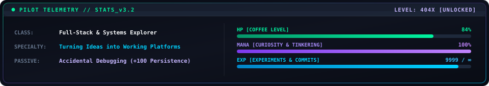
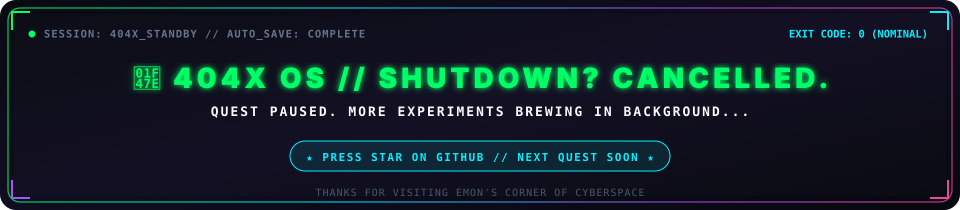

<!-- ========================================================================= -->
<!--                      404X OS // BOOT PROTOCOL v2.4                         -->
<!--             404: SERIOUS DEVELOPER NOT FOUND. JUST EmOn DOING SIDE QUESTS.   -->
<!-- ========================================================================= -->

<div align="center">

  <!-- Animated Hero Banner -->
  <a href="https://github.com/emon404x">
    
  </a>

  <br/><br/>

  <!-- Dynamic Typing Animation SVG -->
  <a href="https://github.com/emon404x">
    
  </a>

  <br/>

  <!-- Gaming Status HUD Badges -->
  <p>
    <a href="https://github.com/emon404x">
      
    </a>&nbsp;
    <a href="https://github.com/emon404x">
      
    </a>&nbsp;
    <a href="https://github.com/emon404x">
      
    </a>&nbsp;
    <a href="https://github.com/emon404x">
      
    </a>
  </p>

  

</div>

<br/>

## 🎮 PLAYER 01 // ABOUT ME

```
+-------------------------------------------------------------------------------+
|  NAME: EmOn                          |  LOCATION: Dhaka, BD [GMT+6]           |
|  HANDLE: emon404x                    |  FACTION: Rogue Code Tinkerers         |
|  CLASS: Full-Stack & Systems Novice  |  PASSIVE: Accidental Debugging         |
+-------------------------------------------------------------------------------+
```

<table border="0" width="100%">
  <tr>
    <td width="32%" align="center" valign="middle">
      <br/>
      <sub><b>PILOT: EmOn</b> // <code>[ONLINE]</code></sub>
    </td>
    <td width="68%" valign="top">
      
    </td>
  </tr>
</table>

### 🕹️ Pilot Briefing
> Welcome to my little corner of cyberspace. I am **EmOn** — a casual developer messing around with code, building random projects, learning how things actually work beneath the abstractions, and embarking on endless coding side quests.
>
> - 🧩 **Philosophy:** *"Sometimes the code works on the first try. That is usually when I get suspicious."*
> - 🔍 **Method:** Building things, breaking things, and learning why computers do what I tell them instead of what I thought I meant.
> - 🎯 **Main Quest:** Become a genuinely solid software builder who understands both high-level systems and low-level mechanics.
> - 🗺️ **Side Quests:** Literally whatever weird tech idea catches my curiosity at 2:00 AM.

<br/>

<div align="center">
  
</div>

<br/>

## 🗺️ CURRENT SIDE QUESTS

| Quest Code | Objective | Focus Areas | Guild Status |
| :--- | :--- | :--- | :---: |
| `QUEST-01` | **Full-Stack Web Ecosystems** | Python • Django 5 • PostgreSQL • REST Architecture | `[ BUILDING ]` |
| `QUEST-02` | **Systems & Low-Level Sorcery** | C • C++ • Memory Management • Pointer Logic | `[ EXPLORING ]` |
| `QUEST-03` | **Reactive Frontend Interfaces** | TypeScript • React • Vite • Modern CSS Systems | `[ LEVELING UP ]` |
| `QUEST-04` | **Defensive Security & Network Labs** | Packet Analysis • Log Parsing • Secure Code Practices | `[ QUEST ACCEPTED ]` |
| `QUEST-05` | **Data Structures & Problem Solving** | Algorithmic Thinking • Edge Cases • Clean Code | `[ IN PROGRESS ]` |

<br/>

<div align="center">
  
</div>

<br/>

## 🧪 EXPERIMENT LAB // THINGS I ACTUALLY BUILT

> Real projects with authentic codebases — no inflated claims, no fictitious enterprise systems.

### 🌐 [FoodFlow-Website](https://github.com/emon404x/FoodFlow-Website)
> **Expiry-Aware Food Donation Platform — Frontend Client**  
> 🔗 **Live Web App:** [food-flow-website.vercel.app](https://food-flow-website.vercel.app) • 💻 **Repo:** [`emon404x/FoodFlow-Website`](https://github.com/emon404x/FoodFlow-Website)

- **The Problem:** Good food goes to waste every single day while communities go hungry, largely because donors and shelters have no live way to track expiry urgency.
- **What It Does:** A high-speed reactive web platform connecting food donors with verified recipients. Features real-time synchronized expiry countdowns, dynamic urgency badges (`SAFE >6h`, `WARNING 2-6h`, `URGENT <2h`, `EXPIRED`), interactive donation claim modals, and responsive layouts.
- **Tech Armor:** `TypeScript` • `React` • `Vite` • `Modern CSS` • `Vercel`

```
[ LIVE COUNTDOWN ] ---> [ URGENCY ENGINE ] ---> [ CLAIM MODAL ] ---> [ HANDOVER TOKEN ]
```

---

### 🛡️ [FoodFlow-Web](https://github.com/emon404x/FoodFlow-Web)
> **Full-Stack Django Expiry-Aware Platform — Backend & System Engine**  
> 💻 **Repo:** [`emon404x/FoodFlow-Web`](https://github.com/emon404x/FoodFlow-Web) • 🎓 *University CSE Lab Project*

- **The Problem:** Concurrency race conditions when multiple recipients claim the same scarce meal, plus accidental donation of spoiled/high-risk items.
- **What It Does:** Full-stack Django 5 web application featuring:
  - **Dual Role Auth:** Separate dashboards and permissions for Donors, Recipients, and Admins.
  - **Race-Condition Protection:** Concurrency-safe atomic claims using database row-locking (`select_for_update`) and transactional boundaries (`transaction.atomic`).
  - **Automated Safety Screening:** Real-time keyword filtering blocking high-risk food submissions.
  - **Handover Verification:** Generates cryptographic 8-character pickup verification tokens checked during physical handover.
  - **Automated Expiry Sweep:** Two-layer auto-hiding with background sweep management commands.
- **Tech Armor:** `Python 3.14` • `Django 5.x` • `PostgreSQL` • `SQLite3` • `WhiteNoise`

<br/>

<div align="center">
  
</div>

<br/>

## 🧰 INVENTORY // WEAPONS & GEAR

<div align="center">

### ⚔️ Primary Weapons (Core Languages)
<p>
  <a href="https://skillicons.dev">
    
  </a>
</p>
<sub><em>C &amp; C++ for close-to-metal thinking • Python &amp; Java for solid backends • JS/TS for interactive frontends</em></sub>

<br/><br/>

### 🛡️ Web Armor & Frameworks
<p>
  <a href="https://skillicons.dev">
    
  </a>
</p>
<sub><em>Django for batteries-included backends • React &amp; Vite for fast UI feedback • Clean HTML5/CSS3</em></sub>

<br/><br/>

### 🗄️ Data Vaults & Cloud
<p>
  <a href="https://skillicons.dev">
    
  </a>
</p>
<sub><em>ACID transactions with SQLite &amp; PostgreSQL • Instant edge serverless deployments with Vercel</em></sub>

<br/><br/>

### 🛠️ Workbench & Systems Kit
<p>
  <a href="https://skillicons.dev">
    
  </a>
</p>
<sub><em>Linux terminal environments • Git branching &amp; workflows • Automating repetitive tasks</em></sub>

</div>

<br/>

<div align="center">
  
</div>

<br/>

## 💻 404X TERMINAL // LIVE SESSION

```bash
emon@404x-workstation:~$ whoami
EmOn — casual developer, occasional bug hunter, full-time side-quester.

emon@404x-workstation:~$ cat /etc/404x_runtime.json
{
  "system": "404X_OS",
  "developer_found": false,
  "status": "Exploring new side quests",
  "favorite_fuel": "Iced Purple Shake / Strong Coffee",
  "active_stack": ["Python", "Django", "C/C++", "TypeScript", "React", "Linux"],
  "known_issue": "Occasionally starts a new project before finishing the last three"
}

emon@404x-workstation:~$ ./check_quest_log.sh
[✓] FoodFlow-Website ............ Live & ticking on Vercel
[✓] FoodFlow-Web (Django) ....... Concurrency-safe atomic claims & auto-sweep verified
[~] C/C++ Systems & DSA ......... Low-level memory experiments in progress
[?] Sleep schedule .............. 404: File Not Found

emon@404x-workstation:~$ git commit -m "fixed 1 typo, accidentally rewrote the entire architecture"
[main 7f0404x] fixed 1 typo, accidentally rewrote the entire architecture
 14 files changed, 512 insertions(+), 320 deletions(-)

emon@404x-workstation:~$ exit
logout
[Process completed — but EmOn is already working on another commit]
```

<br/>

<div align="center">
  
</div>

<br/>

## 📊 CODING LORE // PLAYER STATS

<div align="center">

  <!-- GitHub Readme Stats Card (Neon Dark Theme) -->
  <a href="https://github.com/emon404x">
    
  </a>
  <!-- Top Languages Card (Neon Dark Theme) -->
  <a href="https://github.com/emon404x">
    
  </a>

  <br/><br/>

  <!-- Streak Stats Card (Neon Dark Theme) -->
  <a href="https://github.com/emon404x">
    
  </a>

</div>

<br/>

<div align="center">
  
</div>

<br/>

## 🐍 THE CONTRIBUTION RUN // SNAKE ENGINE

<!-- GitHub Actions Platane/snk Contribution Snake -->
<div align="center">
  <p><sub><code>[ AUTO-GENERATED BY GITHUB ACTIONS // EATING DAILY COMMITS ]</code></sub></p>

  <picture>
    <source media="(prefers-color-scheme: dark)" srcset="https://raw.githubusercontent.com/emon404x/emon404x/output/github-snake-dark.svg">
    <source media="(prefers-color-scheme: light)" srcset="https://raw.githubusercontent.com/emon404x/emon404x/output/github-snake.svg">
    
  </picture>

  <br/>
  <sub><em>Automated daily at midnight UTC via <code>.github/workflows/snake.yml</code> with custom neon-green palette.</em></sub>
</div>

<br/>

<div align="center">
  
</div>

<br/>

## 👾 404X OS // SHUTDOWN? CANCELLED.

<div align="center">

  <!-- Animated Retro Arcade Footer Banner -->
  <a href="https://github.com/emon404x">
    
  </a>

  <br/><br/>

  <!-- Connect & Signal Badges -->
  <p>
    <a href="https://github.com/emon404x">
      
    </a>&nbsp;
    <a href="https://food-flow-website.vercel.app">
      
    </a>&nbsp;
    <a href="mailto:mdaktaruzzman1156@gmail.com">
      
    </a>
  </p>

  <p>
    <sub>🎮 <i>Built with curiosity, coffee, and countless terminal tabs. Press ★ if you enjoyed the side quest!</i></sub>
  </p>

</div>
